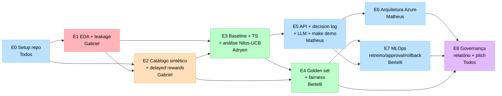

# Plano de Execução — Datathon 7-MLET Fase 5

> **Tema:** Experimentação Adaptativa em Ofertas Financeiras
> **Base Kaggle:** Bank Marketing (henriqueyamahata) — UCI Bank Marketing
> **Prazo:** 20/07/2026 (8 semanas a partir de 26/05/2026)
> **Grupo:** G61 — `DatathonG61`
> **Repo:** https://github.com/DatathonG61/BankMarketing
> **Project:** https://github.com/orgs/DatathonG61/projects/2

---

## Contexto

O desafio é **uma plataforma de experimentação adaptativa (multi-armed bandits) end-to-end**, não um relatório comparativo. A base **Bank Marketing** serve como **base factual de propensão**, sobre a qual o grupo constrói:

1. camada sintética de braços de oferta, eventos e recompensas atrasadas;
2. baseline determinístico + política adaptativa (Thompson Sampling; análise de Nilos-UCB);
3. API auditável de decisão com log estruturado e assistente LLM;
4. arquitetura-alvo Azure exclusiva, com plano de deploy;
5. ciclo MLOps (MLflow, retreino, approval gate, rollback);
6. governança (Model Card, System Card, LGPD), FinOps e pitch.

### Sobre a base de dados (decisão fechada)

Usaremos a base **Bank Marketing** do Kaggle (`henriqueyamahata/bank-marketing`), derivada do dataset Bank Marketing da UCI. Características que orientam o projeto:

- **Colunas factuais:** `age` (idade), `job` (profissão), `marital`, `education`, `default` (crédito em inadimplência), `housing`, `loan`, `contact`, `campaign`, `pdays`, `previous`, `poutcome`, + indicadores macroeconômicos (`emp.var.rate`, `cons.price.idx`, `cons.conf.idx`, `euribor3m`, `nr.employed`).
- **⚠️ Não existe coluna de saldo (`balance`).** O arquivo indicado (`bank-additional-full.csv`) é a variante *with social/economic context*, que **não traz `balance`** — diferente do `bank-full.csv` clássico do UCI (que tem saldo mas não os indicadores macro, e **não está** neste dataset do Kaggle). As duas versões não são casáveis (testado: ~0,1% de match, sem chave de cliente). O brief original menciona "saldo"; reconciliamos usando proxies de capacidade financeira (`default`, `job`, `loan`, `housing`) — ver segmentação sintética abaixo.
- **Vazamento temporal:** a coluna **`duration`** (duração do último contato) deve ser **removida** — ela só é conhecida *depois* da ligação e prevê o passado com informação do futuro. Documentar a remoção em `data/kaggle/README.md`.
- **Target factual:** `y` (assinou depósito a prazo: sim/não) — usado para o baseline preditivo de propensão.
- **Ofertas sintéticas (braços):** sobre a base, criamos um catálogo de ofertas:
  - `sem_oferta` (controle / não ofertar)
  - `cartao_credito` — **Oferta A: Cartão de Crédito**
  - `investimento` — **Oferta B: Investimento**
  - `renegociacao` — plano de renegociação (para clientes negativados: `default = "yes"`)
- **Segmentos sintéticos (proxies de capacidade financeira, sem `balance`):** `jovem_baixa_renda` (idade baixa + `job` de menor renda: student/unemployed/blue-collar/services), `maduro_alta_renda` (idade alta + `job` de maior renda: management/retired/self-employed/admin. + `default = "no"`), `negativado` (`default = "yes"`).
- **Hipóteses de negócio a testar:** jovem/baixa renda → cartão de crédito; maduro/alta renda → investimento; negativado (`default = "yes"`) → renegociação em vez de crédito.

**Estado de setup (30/05/2026):**
- Org `DatathonG61` criada
- Repo `DatathonG61/BankMarketing` público, branch `main`, CI verde
- `pyproject.toml` com `name = "bankmarketing"` (Python 3.13 via uv)
- Estrutura de pastas (`data/`, `docs/`, `src/`, `notebooks/`, `infra/`, `reports/`, `tests/`, `scripts/`) commitada
- `.github/` populado: issue template guiado, PR template, workflow CI (ruff + pytest via uvx)
- Project #2 criado com campos (Status, Etapa, Papel, Semana, Prioridade, Estimate)

**Pendências de setup:**
- Configurar build system + layout `src/bankmarketing/` (pacote ainda não importável)
- Renomear `src/datathon_offerexp/` → `src/bankmarketing/`
- Convidar Adryen, Bertelli (Douglas), Matheus na org (precisa username GitHub)
- Atualizar o campo `Papel` do Project para a divisão por pessoas
- Criar as Views do Project pela UI (Kanban, Por pessoa, Roadmap, Por etapa, Bloqueios)

---

## Princípios estruturantes

1. **Plataforma > experimento.** O alvo é um sistema que aprende sozinho decisão a decisão. "Rodei um notebook e o modelo X ganhou" é penalizado pela banca.
2. **Etapas acumulativas.** A banca afirma que "uma etapa posterior não compensa uma etapa anterior ausente". Não dá pra deixar E1 (EDA/leakage) frouxa pra investir mais em E5 (API).
3. **Integração contínua, não big-bang.** Toda sexta o sistema roda ponta a ponta (`make demo`), no estado em que estiver. Regra não-negociável a partir da semana 3.

---

## Divisão por pessoas

Baseado em `ref_docs/Divisão de tarefas.md`. Cada integrante tem **etapas-foco** próprias e contribui na governança coletiva (E0 e E8).

| # | Integrante | Email | Papel | Etapas-foco | Governança (E8) |
|---|---|---|---|---|---|
| 1 | **Gabriel Caetano Guimarães de Mello** | mellogcg@gmail.com | **Eng. de Dados** | E1 (base + EDA), E2 (sintéticos) | `lgpd-plan.md` |
| 2 | **Adryen Simões de Oliveira** | adryen.simoes@outlook.com | **Cientista de Dados** | E3 (baseline + bandit + métricas) | `model-card.md` + `system-card.md` |
| 3 | **Douglas Bertelli Tineu** | douglas.bertelli@outlook.com | **Eng. MLOps & Avaliação** | E4 (golden set + fairness), E7 (MLflow + ciclo) | `model-card.md` + `system-card.md` |
| 4 | **Matheus Viana Florencio** | ma.viana2018@gmail.com | **Backend / Cloud & LLM** | E5 (API + LLM), E6 (Azure) | FinOps (ROI / TCO / custo Azure) |

### Responsabilidades detalhadas

- **Gabriel (Eng. de Dados):** baixa a base Bank Marketing do Kaggle, faz a EDA, cria o dicionário de dados e **remove `duration`** (vazamento temporal). Constrói toda a camada sintética em `data/synthetic_enrichment/` — catálogo de ofertas, eventos e simulações de *delayed rewards* com sementes controladas. Escreve o `lgpd-plan.md`.
- **Adryen (Cientista de Dados):** foca 100% na lógica de decisão. Implementa a `BaselinePolicy` (regra fixa) e o algoritmo de exploração bayesiana (Thompson Sampling / análise de Nilos-UCB). Calcula as métricas exigidas: **recompensa, regret, exploração e conversão**. Garante que o algoritmo funciona e gera métricas comparativas. Co-autor de `model-card.md` e `system-card.md`.
- **Bertelli (MLOps & Avaliação):** pega o modelo do Adryen e o coloca à prova. Constrói o **Golden Set** (`evaluation_cases.jsonl`, ≥ 20 casos típicos/borda/adversariais), gera a matriz de métricas e a análise de **fairness**. Configura o **MLflow** e documenta o plano de **retreino, aprovação humana e rollback** (E7). Co-autor de `model-card.md` e `system-card.md`.
- **Matheus (Backend/Cloud & LLM):** constrói a "cara" do projeto. Cria a **API / app / notebook** que recebe o contexto do cliente e devolve a decisão com **log de auditoria**. Implementa o **assistente LLM** (resume experimentos, explica decisões e políticas internas). Desenha a **arquitetura Azure** (`docs/architecture-azure.md`) e o plano de **Key Vault**. Levanta os custos de nuvem (**FinOps**).
- **Todos juntos (E0 e E8):** configuram o repositório inicial no GitHub, consolidam o **relatório técnico de 10 páginas** e montam os **slides do pitch**.

---

## Forma do trabalho (dependências entre etapas)

- E0 destrava todo mundo. E1 e E2 são ambas do Gabriel (data → sintéticos, sequenciais).
- E3 (Adryen) depende de E1 (features) **e** E2 (recompensas) — nó crítico do caminho.
- E5 (Matheus) sobe com baseline simples antes de E3 estabilizar TS — força integração na semana 3.
- E4 e E7 (Bertelli) consomem o modelo do Adryen e a API do Matheus.
- E8 começa cedo (Model Card draft, relatório seção dados).

---

## Etapas E0 → E8

Cada etapa: **objetivo · por quê · entregáveis · responsável · Definition of Done**.

### E0 — Organização do Projeto
- **Objetivo:** repositório público reutilizável por externo sem contexto oral.
- **Por quê:** falhar aqui condena tudo.
- **Entregáveis:** README populado, `pyproject.toml` com `bankmarketing`, `.env.example`, esqueleto `src/bankmarketing/`, diretórios versionados, CI verde, PR template, licença, Project linkado.
- **Quem:** **Todos** (coord.: Gabriel para repo/docs, Matheus para tooling/build).
- **DoD:** externo clona, roda `uv sync && uv run pytest && make demo`, tudo passa.

### E1 — Base Kaggle e EDA — **Gabriel**
- **Objetivo:** transformar o Bank Marketing em fonte confiável, sem leakage.
- **Por quê:** leakage não detectado faz tudo o resto virar teatro.
- **Entregáveis:** `data/kaggle/README.md`, notebook EDA, dicionário de dados, `modeling_table.parquet` **sem a coluna `duration`** (e demais colunas pós-decisão), `data.py` loader com metadata.
- **Quem:** **Gabriel lidera.** Bertelli revisa a decisão de leakage; Adryen valida features que alimentam o bandit.
- **DoD:** `load_modeling_table()` roda e **nenhuma coluna é informação pós-contato** (`duration` ausente).

### E2 — Enriquecimento Sintético — **Gabriel**
- **Objetivo:** camada de experimentação adaptativa sobre o dataset.
- **Por quê:** sem braços e recompensas, não há bandit; gerador trivial faz o modelo aprender o gerador.
- **Entregáveis:** `offer_catalog` (`sem_oferta`, `cartao_credito`, `investimento`, `renegociacao`), `offer_events`, `delayed_rewards`, `reports/data-generation.md`, schemas em código, **seeds controladas**.
- **Quem:** **Gabriel lidera.** Bertelli faz "ataque ao gerador"; Adryen valida consistência de contexto com as features de E1.
- **DoD:** Bertelli treina classificador "qual braço maximiza reward?" sem contexto — se accuracy ≈ 100%, gerador é trivial demais e precisa de ruído.

### E3 — Baseline e Estratégia Algorítmica — **Adryen**
- **Objetivo:** comparar baseline com bandit, tratando cold-start e delayed rewards.
- **Por quê:** coração intelectual. Sem comparação quantitativa, não há tese.
- **Entregáveis:** `BaselinePolicy`, `ThompsonSamplingPolicy`, análise de Nilos-UCB, replay offline, métricas (**recompensa, regret, exploração, conversão**), tratamento de cold-start documentado.
- **Quem:** **Adryen lidera.** Gabriel garante features; Matheus garante contrato compatível com a API.
- **DoD:** troca de política via flag `--policy=baseline|thompson` muda o log e as métricas.

### E4 — Avaliação Offline e Golden Set — **Bertelli**
- **Objetivo:** medir qualidade e risco antes de servir.
- **Por quê:** golden set é o regression test da política.
- **Entregáveis:** `evaluation.py` por CLI, `evaluation_cases.jsonl` ≥ 20 casos (típicos, borda, adversariais), `offline-evaluation.md`, `fairness-review.md`.
- **Quem:** **Bertelli lidera** métricas/fairness. Adryen fornece a política; Matheus garante que o golden set roda contra a API.
- **DoD:** `python -m bankmarketing.evaluation` roda < 5 min e gera relatório com a matriz de métricas.

### E5 — Serviço Demonstrável (API) + Assistente LLM — **Matheus**
- **Objetivo:** expor a decisão de forma controlada e auditável, com explicação em linguagem natural.
- **Por quê:** se a banca não executa uma decisão de exemplo, conceito não importa. Assistente LLM é exigência do edital.
- **Entregáveis:** FastAPI `POST /decide`, `contracts.py` pydantic, `decision_log.py` (SQLite), assistente LLM que lê o log e explica/resumir decisões e políticas, `Makefile` com `make demo`, testes.
- **Quem:** **Matheus lidera.** Adryen garante a política plugada; Bertelli garante que o log alimenta o golden set.
- **DoD:** pessoa externa roda `make demo`, digita um perfil de cliente e vê **"Recomendação: Oferta B — Motivo: perfil maduro de maior renda, sem inadimplência — versão do modelo: v1.0"** + log de auditoria, sem ajuda.

### E6 — Arquitetura-alvo Azure — **Matheus**
- **Objetivo:** demonstrar como rodaria em Azure (sem subir).
- **Por quê:** critério **obrigatório** — outras nuvens fora de escopo.
- **Entregáveis:** `docs/architecture-azure.md` com Mermaid (Container Apps + Functions + API Management + App Insights + Cosmos DB + Data Lake Gen2 + Azure OpenAI + AI Search + **Key Vault** + Managed Identity), `deployment-plan.md`, estimativa qualitativa de custo.
- **Quem:** **Matheus lidera.** Bertelli na observabilidade/MLOps; Adryen na camada de modelo.
- **DoD:** diagrama é coerente com `src/` — sem componente fantasma desconectado; segredos via Key Vault documentados.

### E7 — Ciclo de vida MLOps — **Bertelli**
- **Objetivo:** como nova política sai de experimento para produção controlada.
- **Por quê:** sem ciclo, plataforma vira A/B test glorificado.
- **Entregáveis:** MLflow tracking, ≥ 3 políticas versionadas, `retraining-approval-plan.md` com critérios objetivos, **approval gate humano**, **rollback** testado, `observability-plan.md`.
- **Quem:** **Bertelli lidera.** Adryen define critérios numéricos; Gabriel roda script de retreino; Matheus integra com a API.
- **DoD:** documento de 1 página descreve "nova hipótese → experimento → aprovação humana → produção → rollback" e cada passo é executável.

### E8 — Governança, Demo Day e Relatórios — **Todos**
- **Objetivo:** fechar com responsabilidade operacional e narrativa coerente.
- **Por quê:** carrega muito peso na nota de **negócio**.
- **Entregáveis:**
  - `model-card.md` + `system-card.md` — **Adryen + Bertelli**
  - `lgpd-plan.md` — **Gabriel**
  - FinOps (ROI / TCO / custo Azure) — **Matheus**
  - relatório técnico ≤ 10 pgs + pitch + slides + gravação backup — **Todos**
- **DoD:** 3 ensaios cronometrados antes do Demo Day; backup pronto; checklist 100% verde.

---

## Cronograma 8 semanas — quadro por pessoa

| Semana | Gabriel — Data/Sintéticos | Adryen — Bandit | Bertelli — Aval./MLOps | Matheus — Backend/Cloud/LLM |
|---|---|---|---|---|
| **1** 26/05–01/06 | Baixa Bank Marketing. EDA. Identifica `duration` + leakage. | Lê Russo et al. + survey UCB. Esboça contratos. | Apoia E0. Lê edital de avaliação. Esboça golden set. | **E0 completo:** build, src/, README, CI, templates, Makefile. |
| **2** 02/06–08/06 | `modeling_table.parquet` sem `duration` + `data.py`. Schema sintético. | `BaselinePolicy`. Métrica baseline. | Esboço `evaluation.py`. Define métricas-alvo. | API stub `/decide`. Contratos pydantic congelados. Testes. |
| **3** 09/06–15/06 | `offer_catalog` + eventos + `delayed_rewards` v1. `data-generation.md`. | `ThompsonSamplingPolicy` v1. Replay offline. Regret. | "Ataque ao gerador". MLflow ligado (file-based). | `decision_log.py` (SQLite). Integra baseline. **`make demo` ponta a ponta.** |
| **4** 16/06–22/06 **Retro 19/06** | Finaliza camada sintética. Apoia features. | TS estável. Análise Nilos-UCB. Métricas finais. | Golden set ≥ 20 casos. Tracking de runs. | Integra TS na API com flag `--policy`. |
| **5** 23/06–29/06 | Apoia integração de features → API. | Apoia avaliação. Ajusta priors. | `offline-evaluation.md` + `fairness-review.md`. | API completa + tratamento de erro. Protótipo RAG. |
| **6** 30/06–06/07 | Script de retreino (baseline). | `model-card.md` draft (com Bertelli). | Critérios de promoção + rollback documentado. | `architecture-azure.md` + Key Vault + custo. LLM integrado. |
| **7** 07/07–13/07 | `lgpd-plan.md`. Relatório seção dados. | Revisão quantitativa. `system-card.md` (com Bertelli). | Approval gate + rollback testado. MLflow ≥ 3 políticas. `observability-plan.md`. | FinOps (ROI/TCO). Relatório seção arquitetura. |
| **8** 14/07–20/07 | Ensaio pitch (dados/LGPD). | Ensaio pitch (algoritmo). | Ensaio pitch (avaliação/MLOps). | Ensaio pitch (arquitetura/demo). Demo polida + backup. Slides finais. |

> **Freeze: quarta 16/07 às 18h.** Só polimento, doc, slides, ensaios depois.

---

## Cerimônias

| Cerimônia | Frequência | Duração | Propósito |
|---|---|---|---|
| Async stand-up | Diária (úteis) | 2 min texto | "Ontem/hoje/bloqueado" no canal |
| Sync semanal | Sexta | 30 min | Demo do estado integrado + plano da semana |
| Retrospectiva | Sexta 19/06 (sem. 4) | 60 min | Última chance de cortar escopo com tempo de reagir |
| Code review pair | Por PR | — | 2 revisores; nada vai pra `main` sem 2 aprovações |
| Ensaio pitch | Sem. 8 (× 3) | 45 min | Seg/qua/sex da semana final |

**Regras de PR:** branch curta (`feat/eda-leakage`), nunca > 5 dias; PR menciona etapa (E0–E8); CI verde obrigatório; squash merge.

---

## Riscos e Mitigações

| Risco | Prob. | Impacto | Mitigação |
|---|---|---|---|
| Esquecer de remover `duration` (leakage) | Média | Crítico | Remoção explícita em E1, revisada por Bertelli; teste em `tests/test_data.py` falha se `duration` presente. |
| Bank Marketing pobre em features de contexto p/ bandit | Média | Alto | Gabriel deriva contexto sintético (segmento, canal, histórico) em E2 a partir de `age`/`job`/`default`/`loan` (não há `balance` na base). |
| Gerador sintético embute resposta | Alta | Alto | Bertelli faz "ataque ao gerador" sem. 3; Gabriel documenta seeds; revisão Gabriel↔Bertelli semanal. |
| Integração só no fim | Alta | Crítico | `make demo` rodando ponta a ponta desde sem. 3. Sync semanal verifica. |
| LLM/RAG fica pro fim | Alta | Médio | Matheus faz protótipo RAG sem. 5 com docs placeholder. |
| Sobrecarga do Gabriel (E1+E2 sequenciais) | Média | Alto | E1 fecha na sem. 2; sem. 3 dedicada a E2. Adryen/Bertelli desbloqueiam revisões rápido. |
| Pitch atropelado | Alta | Alto | Slides v0 sem. 6, 3 ensaios sem. 8, backup gravado sem. 7. |
| Demo ao vivo falha | Média | Médio | Gravação backup obrigatória. Cenário pré-renderizado como contingência. |
| `src/datathon_offerexp/` quebra import | Alta | Médio | **Renomear para `src/bankmarketing/` no primeiro PR E0** (sem. 1). Bloqueador absoluto. |

---

## Critérios "Pronto para Demo Day"

- [ ] README explica desafio, execução, limitações
- [ ] Pipeline usa Bank Marketing com download/versão/licença documentados
- [ ] **`duration` removida** e decisão de leakage documentada
- [ ] Base processada e sintética documentadas e separadas
- [ ] Experimentos em MLflow
- [ ] ≥ 1 baseline + abordagem principal comparados
- [ ] Análise algorítmica referencia TS e Nilos-UCB
- [ ] Golden set ≥ 20 exemplos
- [ ] Camada retreino/teste/aprovação/promoção documentada
- [ ] API demonstrável funciona + log de auditoria
- [ ] Assistente LLM explica decisões/políticas
- [ ] Arquitetura exclusivamente Azure + diagrama Mermaid
- [ ] Guardrails testados com cenários adversariais
- [ ] Model Card, System Card, LGPD completos
- [ ] Pitch: problema/abordagem/demo/evidências/riscos/impacto
- [ ] Pitch cobre FinOps (ROI, custo, TCO)
- [ ] Demo + plano de contingência

---

## Backlog completo de issues (semanas 1–8)

Legenda:
- ✅ #N — issue criada e linkada ao Project
- 📋 — pendente, criar conforme o time avança
- **P0/P1/P2** — prioridade (P0 bloqueador)

### Semana 1 (26/05 – 01/06)

| ID | Título | Etapa | Responsável | Pri | Status |
|---|---|---|---|---|---|
| W1-01 | [E0] Configurar pacote `bankmarketing` (build + layout `src/`) | E0 | Matheus | P0 | 📋 |
| W1-02 | [E0] Renomear `src/datathon_offerexp/` → `src/bankmarketing/` + módulos stub | E0 | Matheus | P0 | 📋 |
| W1-03 | [E0] Popular `README.md` raiz do repo | E0 | Gabriel | P0 | 📋 |
| W1-04 | [E0] Criar `.env.example` com placeholders Azure | E0 | Matheus | P1 | 📋 |
| W1-05 | [E0] Criar `Makefile` com targets install/test/lint/demo | E0 | Matheus | P0 | 📋 |
| W1-06 | [E0] Adicionar licença ao repo | E0 | Todos | P1 | 📋 |
| W1-07 | [E1] Baixar Bank Marketing e popular `data/kaggle/README.md` | E1 | Gabriel | P0 | 📋 |
| W1-08 | [E1] EDA inicial + dicionário + lista de leakage (`duration`) | E1 | Gabriel | P0 | 📋 |
| W1-09 | [E2] Schema dos eventos sintéticos em `reports/data-generation.md` | E2 | Gabriel | P0 | 📋 |
| W1-10 | [E3] Leitura Russo et al. + esboço `docs/algorithmic-strategy.md` | E3 | Adryen | P1 | 📋 |
| W1-11 | [E4] Esboço do golden set + critérios de avaliação | E4 | Bertelli | P1 | 📋 |
| W1-12 | [E0] Onboarding dos 4 integrantes | E0 | Todos | P0 | 📋 |
| W1-13 | [E0] Convidar Adryen/Bertelli/Matheus na org + atualizar campo Papel | E0 | Gabriel | P0 | 📋 |

### Semana 2 (02/06 – 08/06)

| ID | Título | Etapa | Responsável | Pri | Status |
|---|---|---|---|---|---|
| W2-01 | [E1] `modeling_table.parquet` sem `duration` + `data.py` loader | E1 | Gabriel | P0 | 📋 |
| W2-02 | [E1] Baseline preditivo de propensão v0 (logistic/lightgbm) | E1 | Gabriel | P1 | 📋 |
| W2-03 | [E2] Gerador `offer_catalog.sample.csv` v0 (Oferta A/B + braços) | E2 | Gabriel | P0 | 📋 |
| W2-04 | [E3] Implementar `BaselinePolicy` determinística | E3 | Adryen | P0 | 📋 |
| W2-05 | [E5] API stub FastAPI `/decide` + contratos pydantic congelados | E5 | Matheus | P0 | 📋 |
| W2-06 | [E5] Integrar deps reais no `pyproject.toml` (FastAPI, mlflow, pydantic) | E5 | Matheus | P0 | 📋 |
| W2-07 | [E4] Definir matriz de métricas-alvo (recompensa/regret/fairness) | E4 | Bertelli | P1 | 📋 |

### Semana 3 (09/06 – 15/06)

| ID | Título | Etapa | Responsável | Pri | Status |
|---|---|---|---|---|---|
| W3-01 | [E2] `offer_events` + `delayed_rewards.sample.csv` finais | E2 | Gabriel | P0 | 📋 |
| W3-02 | [E2] `reports/data-generation.md` completo (seeds, hipóteses) | E2 | Gabriel | P0 | 📋 |
| W3-03 | [E3] `ThompsonSamplingPolicy` v1 funcional | E3 | Adryen | P0 | 📋 |
| W3-04 | [E3] Primeiro replay offline com regret reportado | E3 | Adryen | P0 | 📋 |
| W3-05 | [E4] "Ataque ao gerador" (classificador sem contexto) | E4 | Bertelli | P0 | 📋 |
| W3-06 | [E7] MLflow ligado (file-based) + tracking dos runs | E7 | Bertelli | P0 | 📋 |
| W3-07 | [E5] `decision_log.py` (SQLite) + integra BaselinePolicy real | E5 | Matheus | P0 | 📋 |
| W3-08 | [E5] **`make demo` ponta a ponta verde** (milestone semana 3) | E5 | Matheus | P0 | 📋 |

### Semana 4 (16/06 – 22/06) — Retro sexta

| ID | Título | Etapa | Responsável | Pri | Status |
|---|---|---|---|---|---|
| W4-01 | [E1] Finalizar features de contexto + pipeline → API | E1 | Gabriel | P0 | 📋 |
| W4-02 | [E3] TS estável com parâmetros calibrados | E3 | Adryen | P0 | 📋 |
| W4-03 | [E3] Análise de Nilos-UCB em `docs/algorithmic-strategy.md` | E3 | Adryen | P0 | 📋 |
| W4-04 | [E3] Métricas (recompensa, regret, exploração, conversão) | E3 | Adryen | P0 | 📋 |
| W4-05 | [E4] Golden set ≥ 20 casos em `evaluation_cases.jsonl` | E4 | Bertelli | P0 | 📋 |
| W4-06 | [E5] Integrar TS na API com flag `--policy=baseline\|thompson` | E5 | Matheus | P0 | 📋 |
| W4-07 | Retrospectiva semana 4 (sexta 19/06) — decisão de cortes | — | Todos | P0 | 📋 |

### Semana 5 (23/06 – 29/06)

| ID | Título | Etapa | Responsável | Pri | Status |
|---|---|---|---|---|---|
| W5-01 | [E4] `reports/offline-evaluation.md` (matriz, sensibilidade) | E4 | Bertelli | P0 | 📋 |
| W5-02 | [E4] `reports/fairness-review.md` (exposição entre segmentos) | E4 | Bertelli | P0 | 📋 |
| W5-03 | [E5] API completa + tratamento de erro estruturado (4xx/5xx) | E5 | Matheus | P0 | 📋 |
| W5-04 | [E5] `make demo` polido + cobertura de testes | E5 | Matheus | P0 | 📋 |
| W5-05 | [E5/E6] Protótipo RAG com docs sintéticos de política comercial | E6 | Matheus | P0 | 📋 |
| W5-06 | [E1] Ajustes finais no baseline preditivo | E1 | Gabriel | P1 | 📋 |

### Semana 6 (30/06 – 06/07)

| ID | Título | Etapa | Responsável | Pri | Status |
|---|---|---|---|---|---|
| W6-01 | [E6] `docs/architecture-azure.md` + diagrama Mermaid | E6 | Matheus | P0 | 📋 |
| W6-02 | [E6] Plano de segredos via Key Vault + Managed Identity | E6 | Matheus | P0 | 📋 |
| W6-03 | [E6] Assistente LLM integrado à API (endpoint de explicação) | E6 | Matheus | P0 | 📋 |
| W6-04 | [E7] Critérios quantitativos de promoção (lift, fairness, golden set) | E7 | Bertelli | P0 | 📋 |
| W6-05 | [E7] Procedimento de rollback documentado | E7 | Bertelli | P0 | 📋 |
| W6-06 | [E1] Script de retreino do baseline preditivo | E1 | Gabriel | P1 | 📋 |
| W6-07 | [E8] `docs/model-card.md` draft | E8 | Adryen+Bertelli | P1 | 📋 |

### Semana 7 (07/07 – 13/07)

| ID | Título | Etapa | Responsável | Pri | Status |
|---|---|---|---|---|---|
| W7-01 | [E7] Approval gate humano (template + checklist + responsável) | E7 | Bertelli | P0 | 📋 |
| W7-02 | [E7] Rollback testado end-to-end | E7 | Bertelli | P0 | 📋 |
| W7-03 | [E7] MLflow com ≥ 3 políticas versionadas + critérios aplicados | E7 | Bertelli | P0 | 📋 |
| W7-04 | [E7] `reports/observability-plan.md` (drift, recompensa, exposição) | E7 | Bertelli | P0 | 📋 |
| W7-05 | [E7] `reports/retraining-approval-plan.md` (ciclo completo) | E7 | Bertelli | P0 | 📋 |
| W7-06 | [E8] `docs/system-card.md` (reward hacking, manipulação, viés) | E8 | Adryen+Bertelli | P0 | 📋 |
| W7-07 | [E8] `docs/lgpd-plan.md` (base legal, finalidade, minimização) | E8 | Gabriel | P0 | 📋 |
| W7-08 | [E8] FinOps — custo Azure por serviço + ROI + TCO | E8 | Matheus | P0 | 📋 |
| W7-09 | [E8] Relatório técnico v1 (≤ 10 páginas) | E8 | Todos | P0 | 📋 |

### Semana 8 (14/07 – 20/07)

| ID | Título | Etapa | Responsável | Pri | Status |
|---|---|---|---|---|---|
| W8-01 | [E8] Slides v1 do pitch | E8 | Todos | P0 | 📋 |
| W8-02 | [E8] Ensaio pitch #1 — segunda 14/07 | E8 | Todos | P0 | 📋 |
| W8-03 | [E8] Gravação backup da demo (típico + adversarial) | E8 | Matheus | P0 | 📋 |
| W8-04 | [E8] Ensaio pitch #2 — quarta 16/07 | E8 | Todos | P0 | 📋 |
| W8-05 | **FREEZE de features — quarta 16/07 às 18h** | — | Todos | P0 | 📋 |
| W8-06 | [E8] Revisão cruzada final de docs | E8 | Todos | P0 | 📋 |
| W8-07 | [E8] Ensaio pitch #3 — sexta 18/07 | E8 | Todos | P0 | 📋 |
| W8-08 | [E8] Checklist "Pronto para Demo Day" 100% verde | E8 | Todos | P0 | 📋 |
| W8-09 | [E8] Entrega final — 20/07 | E8 | Todos | P0 | 📋 |

> O `scripts/bootstrap-issues.sh` cria a primeira batch (semanas 1–2). Recomendação: criar 1 semana de antecedência, não todas de uma vez, para evitar ruído no Project.

---

## Apêndice: Decisões de Tecnologia

| Camada | Decisão | Motivo |
|---|---|---|
| Base de dados | **Bank Marketing** (`henriqueyamahata/bank-marketing`) | Campanhas bancárias, propensão, decisão de oferta; `duration` como leakage conhecido |
| Python | 3.13 (via uv) | Já em `.python-version`/`pyproject.toml` |
| Layout | `src/` | Padrão do README oficial |
| Nome do pacote | `bankmarketing` | Alinhado ao repo `DatathonG61/BankMarketing` |
| Lint/format | `ruff` | Substitui black/isort/flake8 |
| Testes | `pytest` (via `uvx` no CI por enquanto) | Padrão |
| API | `FastAPI` | Pydantic v2 + OpenAPI grátis |
| Persistência local | SQLite | Em Azure vira Cosmos DB |
| Tracking | `MLflow` | Exigência do checklist |
| LLM dev local | Azure OpenAI SDK + `Ollama` fallback (só dev) | Compatível com arquitetura final |
| Diagrama | Mermaid | Exigido pelo README |
| Gestão do trabalho | GitHub Projects v2 + Issues + Actions | Tudo no mesmo lugar do código |
| Licença | A confirmar (sugestão MIT) | Decisão da 1ª reunião |

---

## Como atualizar este documento

Este arquivo é **canônico**. Qualquer mudança de escopo, cronograma ou divisão passa por PR:

1. Branch `docs/atualiza-plano-<motivo>`
2. Edita `ref_docs/PLANO.md`
3. PR com label `docs`
4. Aprovação de 2 integrantes
5. Squash merge

Status do backlog (✅/📋) atualizado ao fim de cada semana, na sync de sexta.
