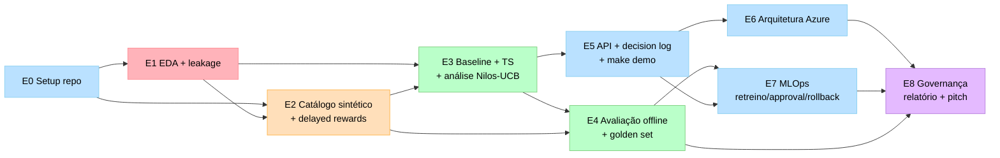

# Plano de Execução — Datathon 7-MLET Fase 5

> **Tema:** Experimentação Adaptativa em Ofertas Financeiras
> **Base Kaggle:** Telemarketing JYB Dataset — UCI
> **Prazo:** 20/07/2026 (8 semanas a partir de 26/05/2026)
> **Grupo:** G61 — `DatathonG61`
> **Repo:** https://github.com/DatathonG61/7mlet
> **Project:** https://github.com/orgs/DatathonG61/projects/2

---

## Contexto

O grupo realizou o kickoff em 23/05/2026 e definiu como escopo "identificar a melhor maneira (canal e abordagem) de entrar em contato com os clientes". Após leitura do `ref_docs/README.md` oficial, ficou claro que o desafio é **uma plataforma de experimentação adaptativa (multi-armed bandits) end-to-end**, não um relatório comparativo. O dataset JYB serve como **base factual de propensão**, sobre a qual o grupo deve construir:

1. camada sintética de braços, eventos e recompensas atrasadas;
2. baseline determinístico + política adaptativa (Thompson Sampling; análise de Nilos-UCB);
3. API auditável de decisão com log estruturado;
4. arquitetura-alvo Azure exclusiva, com plano de deploy;
5. ciclo MLOps (MLflow, retreino, approval gate, rollback);
6. assistente LLM com RAG sobre políticas sintéticas;
7. governança (Model Card, System Card, LGPD), FinOps, pitch.

**Estado de setup (24/05/2026):**
- Org `DatathonG61` criada
- Repo `DatathonG61/7mlet` público, branch `main`, CI verde
- Estrutura de pastas (`data/`, `docs/`, `src/`, `notebooks/`, `infra/`, `reports/`, `tests/`, `scripts/`) commitada
- `.github/` populado: issue template guiado, PR template, workflow CI (ruff + pytest via uvx)
- Project #2 criado com 6 campos (Status, Etapa, Papel, Semana, Prioridade, Estimate)
- 15 issues iniciais criadas e linkadas ao Project (semanas 1–2)

**Pendências de setup:**
- Convidar Adryen, Douglas, Matheus na org (precisa username GitHub)
- Atribuir campo `Papel` em cada issue (decisão na 1ª reunião)
- Criar as 5 Views do Project pela UI (Kanban, Por papel, Roadmap, Por etapa, Bloqueios)
- Confirmar visibilidade do Project (privado por padrão)

---

## Princípios estruturantes

1. **Plataforma > experimento.** O alvo é um sistema que aprende sozinho decisão a decisão. "Rodei um notebook e o modelo X ganhou" é penalizado pela banca.
2. **Etapas acumulativas.** A banca afirma textualmente que "uma etapa posterior não compensa uma etapa anterior ausente". Não dá pra deixar E1 (EDA/leakage) frouxa pra investir mais em E5 (API).
3. **Integração contínua, não big-bang.** Toda sexta o sistema roda ponta a ponta (`make demo`), no estado em que estiver. A regra é não-negociável a partir da semana 3.

---

## Forma do trabalho (dependências entre etapas)



- E0 destrava todo mundo. E1 e E2 rodam parcialmente em paralelo.
- E3 depende de E1 (features) **e** E2 (recompensas) — nó crítico do caminho.
- E5 sobe com baseline simples antes de E3 estabilizar TS — força integração na semana 3.
- E8 começa cedo (Model Card draft, relatório seção dados).

---

## Equipe e papéis (atribuição inicial alfabética — trocar na 1ª reunião)

| # | Integrante | Email | Papel |
|---|---|---|---|
| 1 | Adryen Simões de Oliveira | adryen.simoes@outlook.com | **A — Data & Propensão Lead** |
| 2 | Douglas Bertelli Tineu | douglas.bertelli@outlook.com | **B — Bandit & Avaliação Lead** |
| 3 | Gabriel Caetano Guimarães de Mello | (Gabriel) | **C — Platform & MLOps Lead** |
| 4 | Matheus Viana Florencio | ma.viana2018@gmail.com | **D — Sintéticos, LLM/RAG & Governança Lead** |

### Perfis em uma linha
- **A:** Pandas/Polars, EDA, baseline preditivo (logistic/lightgbm). Pico semanas 1–3.
- **B:** Lê papers Russo et al. (TS) e survey UCB, métricas (regret, exposição), gosto por experimentação offline. Pico semanas 3–5.
- **C:** Git/CI, FastAPI, pytest, MLflow, conceitos Azure. Pico semanas 1 e 5–7.
- **D:** Escrita técnica, schema design, LLM/RAG, sensibilidade ética/LGPD. Pico semanas 4–8.

---

## Etapas E0 → E8

Cada etapa: **objetivo · por quê · entregáveis · responsável · Definition of Done**.

### E0 — Organização do Projeto
- **Objetivo:** repositório público reutilizável por externo sem contexto oral.
- **Por quê:** falhar aqui condena tudo.
- **Entregáveis:** README populado, `pyproject.toml` com `datathon_offerexp`, `.env.example`, esqueleto `src/`, diretórios versionados, CI verde, PR template, licença, Project linkado.
- **Quem:** **C lidera.** A/B/D abrem 1 PR de teste cada.
- **DoD:** externo clona, roda `uv sync && uv run pytest && make demo`, tudo passa.

### E1 — Base Kaggle e EDA
- **Objetivo:** transformar o JYB em fonte confiável, sem leakage.
- **Por quê:** leakage não detectado faz tudo o resto virar teatro.
- **Entregáveis:** `data/kaggle/README.md`, notebook EDA, dicionário, `modeling_table.parquet` sem colunas pós-decisão, `data.py` loader com metadata.
- **Quem:** **A lidera.** D revisa dicionário; B revisa decisão de leakage.
- **DoD:** B roda `load_modeling_table()` e nenhuma coluna é informação pós-contato.

### E2 — Enriquecimento Sintético
- **Objetivo:** camada de experimentação adaptativa sobre o dataset.
- **Por quê:** sem braços e recompensas, não há bandit; gerador trivial faz o modelo aprender o gerador.
- **Entregáveis:** `offer_catalog`, `offer_events`, `delayed_rewards`, `reports/data-generation.md`, schemas em código.
- **Quem:** **D lidera.** A garante consistência de contexto. B faz "ataque ao gerador".
- **DoD:** B treina classificador "qual braço maximiza reward?" sem contexto — se accuracy ≈ 100%, gerador é trivial demais.

### E3 — Baseline e Estratégia Algorítmica
- **Objetivo:** comparar baseline com bandit, tratando cold-start e delayed rewards.
- **Por quê:** coração intelectual. Sem comparação quantitativa, não há tese.
- **Entregáveis:** `BaselinePolicy`, `ThompsonSamplingPolicy`, análise de Nilos-UCB, replay offline, métricas (regret, exposição), tratamento de cold-start documentado.
- **Quem:** **B lidera.** A garante features. C garante contrato compatível com API.
- **DoD:** A troca política via flag `--policy=baseline|thompson` e vê mudança no log e nas métricas.

### E4 — Avaliação Offline e Golden Set
- **Objetivo:** medir qualidade e risco antes de servir.
- **Por quê:** golden set é o regression test da política.
- **Entregáveis:** `evaluation.py` por CLI, `evaluation_cases.jsonl` ≥ 20 casos, `offline-evaluation.md`, `fairness-review.md`.
- **Quem:** **B lidera** métricas/fairness. D contribui casos adversariais.
- **DoD:** `python -m datathon_offerexp.evaluation` roda < 5 min e gera relatório.

### E5 — Serviço Demonstrável (API)
- **Objetivo:** expor decisão de forma controlada e auditável.
- **Por quê:** se a banca não executa uma decisão de exemplo, conceito não importa.
- **Entregáveis:** FastAPI `POST /decide`, `contracts.py` pydantic, `decision_log.py` SQLite, `Makefile` com `make demo`, testes cobrindo contratos/políticas/log.
- **Quem:** **C lidera.** B garante política plugada. D garante que assistente LLM (E6) consome o log.
- **DoD:** pessoa externa roda `make demo` e vê decisão + log sem ajuda.

### E6 — Arquitetura-alvo Azure
- **Objetivo:** demonstrar como rodaria em Azure (sem subir).
- **Por quê:** critério **obrigatório** — outras nuvens fora de escopo.
- **Entregáveis:** `docs/architecture-azure.md` com Mermaid, mapeamento (Container Apps + Functions + API Management + App Insights + Cosmos DB + Data Lake Gen2 + Azure OpenAI + AI Search + Key Vault + Managed Identity), `deployment-plan.md`, estimativa qualitativa de custo.
- **Quem:** **C lidera.** D na camada IA/RAG. B na observabilidade.
- **DoD:** diagrama é coerente com `src/` — sem componente fantasma desconectado.

### E7 — Ciclo de vida MLOps
- **Objetivo:** como nova política sai de experimento para produção controlada.
- **Por quê:** sem ciclo, plataforma vira A/B test glorificado.
- **Entregáveis:** MLflow tracking, ≥ 3 políticas versionadas, `retraining-approval-plan.md` com critérios objetivos, approval gate humano, rollback testado, `observability-plan.md`.
- **Quem:** **C lidera.** B define critérios numéricos. A roda script de retreino. D documenta aspecto humano.
- **DoD:** documento de 1 página descreve "nova hipótese → experimento → aprovação → produção → rollback" e cada passo é executável.

### E8 — Governança, Demo Day e Relatórios
- **Objetivo:** fechar com responsabilidade operacional e narrativa coerente.
- **Por quê:** carrega muito peso na nota de **negócio (30%)**.
- **Entregáveis:** Model Card, System Card, plano LGPD, relatório ≤ 10 pgs, pitch + slides + gravação backup, cobertura FinOps + arquitetura + cenários de escala.
- **Quem:** **D lidera.** C cobre arquitetura/escala. B cobre quantitativos. A cobre dados.
- **DoD:** 3 ensaios cronometrados antes do Demo Day; backup pronto; checklist 100% verde.

---

## Cronograma 8 semanas — quadro por pessoa

| Semana | A — Data | B — Bandit | C — Platform | D — Sintéticos/LLM/Gov |
|---|---|---|---|---|
| **1** 26/05–01/06 | Baixa JYB. EDA inicial. Leakage candidates. | Lê Russo et al. + survey UCB. Esboça contratos. | **E0 completo:** repo, CI, Project, esqueleto src/, templates. | Schema sintético: braços, canais, segmentos, delayed reward. |
| **2** 02/06–08/06 | `modeling_table.parquet`. Baseline preditivo v0. | `BaselinePolicy`. Métrica baseline. | API stub `/decide`. Contratos congelados. Testes. | `offer_catalog` v0. Draft eventos. |
| **3** 09/06–15/06 | Refina features contexto. Dicionário. | `ThompsonSamplingPolicy` v1. Replay offline. Regret. | `decision_log.py` (SQLite). Integra baseline. **`make demo` ponta a ponta.** | Eventos finais + `delayed_rewards` + `data-generation.md`. |
| **4** 16/06–22/06 **Retro 19/06** | Finaliza features. Integra com API. | TS estável. Análise Nilos-UCB. Métricas finais. | MLflow ligado. Integra TS. | Golden set 20+ casos. |
| **5** 23/06–29/06 | Apoia integração. Ajustes preditivo. | `offline-evaluation.md` + `fairness-review.md`. | API completa. Make demo polido. Cobertura testes. | Protótipo RAG com docs sintéticos. |
| **6** 30/06–06/07 | Script de retreino. | Critérios de promoção. Rollback documentado. | `architecture-azure.md`. Key Vault + MI. Custo. | LLM integrado à API. `model-card.md` draft. |
| **7** 07/07–13/07 | Apoia FinOps. Relatório seção dados. | Análise quantitativa final + revisão. | Approval gate. Rollback testado. MLflow ≥ 3 políticas. `observability-plan.md`. | `system-card.md`, `lgpd-plan.md`, relatório v1. |
| **8** 14/07–20/07 | Ensaio pitch (dados). | Ensaio pitch (quantitativos). | Ensaio pitch (arquitetura). Demo polida + backup. | Ensaio pitch (governança). Slides finais. Checklist 100%. |

> **Freeze: quarta 16/07 às 18h.** Só polimento, doc, slides, ensaios depois.

---

## Cerimônias

| Cerimônia | Frequência | Duração | Propósito |
|---|---|---|---|
| Async stand-up | Diária (úteis) | 2 min texto | "Ontem/hoje/bloqueado" no canal |
| Sync semanal | Sexta | 30 min | Demo do estado integrado + plano da semana |
| Retrospectiva | Sexta 19/06 (sem. 4) | 60 min | Última chance de cortar escopo com tempo de reagir |
| Code review pair | Por PR | — | 2 revisores de papéis diferentes; nada vai pra `main` sem 2 aprovações |
| Ensaio pitch | Sem. 8 (× 3) | 45 min | Seg/qua/sex da semana final |

**Regras de PR:** branch curta (`feat/eda-leakage`), nunca > 5 dias; PR menciona etapa (E0–E8); CI verde obrigatório; squash merge.

---

## Riscos e Mitigações

| Risco | Prob. | Impacto | Mitigação |
|---|---|---|---|
| JYB pobre em features de contexto | Média | Alto | A faz EDA sem. 1 com critério "se features < N, trocamos para Bank Marketing". **Decisão até sexta 30/05.** |
| Gerador sintético embute resposta | Alta | Alto | B faz "ataque ao gerador" sem. 3; D documenta seeds; revisão B↔D semanal. |
| Integração só no fim | Alta | Crítico | `make demo` rodando ponta a ponta desde sem. 3. Sync semanal verifica. |
| LLM/RAG fica pro fim | Alta | Médio | D faz protótipo RAG sem. 5 com docs placeholder. |
| Pitch atropelado | Alta | Alto | Slides v0 sem. 6, 3 ensaios sem. 8, backup gravado sem. 7. |
| Demo ao vivo falha | Média | Médio | Gravação backup obrigatória. Cenário pré-renderizado como contingência. |
| Integrante "some" | Média | Variável | Pair review garante 2 pessoas com contexto. Retro sem. 4 redistribui. |
| `pyproject.toml` `7mlet` quebra build | Alta | Médio | **Renomear para `datathon_offerexp` no primeiro PR E0** (sem. 1). Bloqueador absoluto. (Issue #1) |

---

## Critérios "Pronto para Demo Day" (do checklist do README oficial)

- [ ] README explica desafio, execução, limitações
- [ ] Pipeline usa JYB com download/versão/licença documentados
- [ ] Base processada e sintética documentadas e separadas
- [ ] Experimentos em MLflow
- [ ] ≥ 1 baseline + abordagem principal comparados
- [ ] Análise algorítmica referencia TS e Nilos-UCB
- [ ] Golden set ≥ 20 exemplos
- [ ] Camada retreino/teste/aprovação/promoção documentada
- [ ] API demonstrável funciona
- [ ] Arquitetura exclusivamente Azure
- [ ] Diagrama Mermaid do fluxo
- [ ] Guardrails testados com cenários adversariais
- [ ] Model Card, System Card, LGPD completos
- [ ] Pitch: problema/abordagem/demo/evidências/riscos/impacto
- [ ] Pitch cobre FinOps (ROI, custo, TCO)
- [ ] Pitch justifica arquitetura com diagrama + fronteiras + alternativas
- [ ] Pitch apresenta cenários de escala/redução
- [ ] Demo + plano de contingência

---

## Backlog completo de issues (semanas 1–8)

Legenda:
- ✅ #N — issue criada e linkada ao Project (referenciar pelo número)
- 📋 — pendente, criar conforme o time aprovar este plano
- **P0/P1/P2** — prioridade (P0 bloqueador)

### Semana 1 (26/05 – 01/06) — **17 issues**

| ID | Título | Etapa | Papel | Pri | Status |
|---|---|---|---|---|---|
| W1-01 | [E0] Renomear pacote para `datathon_offerexp` | E0 | C | P0 | ✅ #1 |
| W1-02 | [E0] Esqueleto `src/datathon_offerexp/` com módulos stub | E0 | C | P0 | ✅ #2 |
| W1-03 | [E0] Popular `README.md` raiz do repo | E0 | C | P0 | ✅ #3 |
| W1-04 | [E0] Criar `.env.example` com placeholders Azure | E0 | C | P1 | ✅ #4 |
| W1-05 | [E0] Criar `Makefile` com targets install/test/lint/demo | E0 | C | P0 | ✅ #5 |
| W1-06 | [E0] Adicionar licença ao repo | E0 | C | P1 | ✅ #6 |
| W1-07 | [E1] Baixar JYB e popular `data/kaggle/README.md` | E1 | A | P0 | ✅ #7 |
| W1-08 | [E1] EDA inicial + dicionário de dados | E1 | A | P0 | ✅ #8 |
| W1-09 | [E2] Schema dos eventos sintéticos em `reports/data-generation.md` | E2 | D | P0 | ✅ #10 |
| W1-10 | [E3] Leitura Russo et al. + esboço `docs/algorithmic-strategy.md` | E3 | B | P1 | ✅ #12 |
| W1-11 | [E0] Onboarding dos 4 integrantes | E0 | todos | P0 | ✅ #15 |
| W1-12 | [E0] Decisão dataset (manter JYB ou trocar p/ Bank Marketing) até 30/05 | E0 | A+todos | P0 | 📋 |
| W1-13 | [E0] Configurar 5 Views no Project (UI) | E0 | C | P1 | 📋 |
| W1-14 | [E0] Convidar Adryen/Douglas/Matheus na org DatathonG61 | E0 | C | P0 | 📋 |
| W1-15 | [E0] Configurar canal de comunicação (Slack/Discord) + horário sync | E0 | todos | P0 | 📋 |
| W1-16 | [E0] Atribuir campo `Papel` em todas issues após reunião | E0 | C | P1 | 📋 |
| W1-17 | [E2] Esboço inicial do catálogo de braços/canais/segmentos | E2 | D | P1 | 📋 |

### Semana 2 (02/06 – 08/06) — **8 issues**

| ID | Título | Etapa | Papel | Pri | Status |
|---|---|---|---|---|---|
| W2-01 | [E1] `modeling_table.parquet` sem leakage + `data.py` loader | E1 | A | P0 | ✅ #9 |
| W2-02 | [E1] Baseline preditivo v0 (logistic ou lightgbm) | E1 | A | P0 | 📋 |
| W2-03 | [E2] Implementar gerador `offer_catalog.sample.csv` v0 | E2 | D | P0 | ✅ #11 |
| W2-04 | [E2] Draft `offer_events.sample.csv` (sem delayed rewards) | E2 | D | P1 | 📋 |
| W2-05 | [E3] Implementar `BaselinePolicy` determinística | E3 | B | P0 | ✅ #13 |
| W2-06 | [E5] API stub FastAPI `/decide` + contratos pydantic congelados | E5 | C | P0 | ✅ #14 |
| W2-07 | [E5] Suite de testes unitários inicial (contracts, smoke) | E5 | C | P1 | 📋 |
| W2-08 | [E5] Integrar dependências reais no `pyproject.toml` (FastAPI, mlflow, pydantic, etc.) | E5 | C | P0 | 📋 |

### Semana 3 (09/06 – 15/06) — **8 issues**

| ID | Título | Etapa | Papel | Pri | Status |
|---|---|---|---|---|---|
| W3-01 | [E1] Refinar features de contexto (segmento, histórico, canal preferido) | E1 | A | P0 | 📋 |
| W3-02 | [E2] Gerar `delayed_rewards.sample.csv` final | E2 | D | P0 | 📋 |
| W3-03 | [E2] `reports/data-generation.md` completo | E2 | D | P0 | 📋 |
| W3-04 | [E3] `ThompsonSamplingPolicy` v1 funcional | E3 | B | P0 | 📋 |
| W3-05 | [E3] Primeiro replay offline com regret reportado | E3 | B | P0 | 📋 |
| W3-06 | [E5] `decision_log.py` com persistência SQLite | E5 | C | P0 | 📋 |
| W3-07 | [E5] Integrar `BaselinePolicy` à API real (não mais stub) | E5 | C | P0 | 📋 |
| W3-08 | [E5] **`make demo` ponta a ponta verde** (milestone semana 3) | E5 | C | P0 | 📋 |

### Semana 4 (16/06 – 22/06) — Retro sexta — **9 issues**

| ID | Título | Etapa | Papel | Pri | Status |
|---|---|---|---|---|---|
| W4-01 | [E1] Finalizar features de contexto + integrar feature pipeline → API | E1 | A | P0 | 📋 |
| W4-02 | [E3] TS estável com parâmetros calibrados | E3 | B | P0 | 📋 |
| W4-03 | [E3] Análise de Nilos-UCB em `docs/algorithmic-strategy.md` (teórica ou experimental) | E3 | B | P0 | 📋 |
| W4-04 | [E3] Métricas (regret, exposição, exploração, conversão simulada) calculadas | E3 | B | P0 | 📋 |
| W4-05 | [E4] Golden set ≥ 20 casos em `data/golden_set/evaluation_cases.jsonl` | E4 | B+D | P0 | 📋 |
| W4-06 | [E5] Integrar TS na API com flag `--policy=baseline\|thompson` | E5 | C | P0 | 📋 |
| W4-07 | [E7] MLflow ligado (SQLite ou file-based) + tracking de runs B | E7 | C | P0 | 📋 |
| W4-08 | Retrospectiva semana 4 (sexta 19/06) — decisão de cortes de escopo | — | todos | P0 | 📋 |
| W4-09 | [E0] Issue template `tarefa.yml` simples (não-etapa) opcional | E0 | C | P2 | 📋 |

### Semana 5 (23/06 – 29/06) — **6 issues**

| ID | Título | Etapa | Papel | Pri | Status |
|---|---|---|---|---|---|
| W5-01 | [E1] Ajustes finais no baseline preditivo | E1 | A | P1 | 📋 |
| W5-02 | [E4] `reports/offline-evaluation.md` (matriz, sensibilidade, limitações) | E4 | B | P0 | 📋 |
| W5-03 | [E4] `reports/fairness-review.md` (exposição entre segmentos) | E4 | B | P0 | 📋 |
| W5-04 | [E5] API completa + tratamento de erro estruturado (4xx/5xx + reason codes) | E5 | C | P0 | 📋 |
| W5-05 | [E5] `make demo` polido + cobertura de testes (contratos, políticas, log) | E5 | C | P0 | 📋 |
| W5-06 | [E6] Protótipo RAG com docs sintéticos de política comercial | E6 | D | P0 | 📋 |

### Semana 6 (30/06 – 06/07) — **8 issues**

| ID | Título | Etapa | Papel | Pri | Status |
|---|---|---|---|---|---|
| W6-01 | [E1] Script de retreino do baseline preditivo | E1 | A | P0 | 📋 |
| W6-02 | [E6] `docs/architecture-azure.md` + diagrama Mermaid (compute, API, dados, IA/RAG, observabilidade, segurança) | E6 | C | P0 | 📋 |
| W6-03 | [E6] Plano de segredos via Key Vault + Managed Identity | E6 | C | P0 | 📋 |
| W6-04 | [E6] Estimativa qualitativa de custo Azure por serviço | E6 | C | P1 | 📋 |
| W6-05 | [E6] Assistente LLM integrado à API com endpoint de explicação | E6 | D | P0 | 📋 |
| W6-06 | [E7] Critérios quantitativos de promoção (lift ≥ X%, fairness, golden set) | E7 | B+C | P0 | 📋 |
| W6-07 | [E7] Procedimento de rollback documentado (script ou manual) | E7 | C | P0 | 📋 |
| W6-08 | [E8] `docs/model-card.md` draft (intended use, out-of-scope, fairness) | E8 | D | P1 | 📋 |

### Semana 7 (07/07 – 13/07) — **10 issues**

| ID | Título | Etapa | Papel | Pri | Status |
|---|---|---|---|---|---|
| W7-01 | [E8] Análise FinOps — custo qualitativo por serviço Azure + ROI + TCO | E8 | A+B+C | P0 | 📋 |
| W7-02 | [E3] Revisão do relatório técnico — seção experimentos | E3 | B | P0 | 📋 |
| W7-03 | [E7] Approval gate humano (issue template + PR checklist + responsável) | E7 | C+D | P0 | 📋 |
| W7-04 | [E7] Rollback testado end-to-end (execução real do procedimento) | E7 | C | P0 | 📋 |
| W7-05 | [E7] MLflow com ≥ 3 políticas versionadas + critérios aplicados | E7 | C | P0 | 📋 |
| W7-06 | [E7] `reports/observability-plan.md` (drift, recompensa, exposição) | E7 | C | P0 | 📋 |
| W7-07 | [E7] `reports/retraining-approval-plan.md` (ciclo completo documentado) | E7 | C | P0 | 📋 |
| W7-08 | [E8] `docs/system-card.md` (reward hacking, manipulação, viés) | E8 | D | P0 | 📋 |
| W7-09 | [E8] `docs/lgpd-plan.md` (base legal, finalidade, minimização, retenção) | E8 | D | P0 | 📋 |
| W7-10 | [E8] Relatório técnico v1 (≤ 10 páginas) — primeira versão completa | E8 | D + todos | P0 | 📋 |

### Semana 8 (14/07 – 20/07) — **9 issues**

| ID | Título | Etapa | Papel | Pri | Status |
|---|---|---|---|---|---|
| W8-01 | [E8] Slides v1 do pitch (problema/abordagem/demo/evidências/riscos/impacto) | E8 | D | P0 | 📋 |
| W8-02 | [E8] Ensaio pitch #1 — segunda 14/07 | E8 | todos | P0 | 📋 |
| W8-03 | [E8] Gravação backup da demo (cenário típico + adversarial) | E8 | C | P0 | 📋 |
| W8-04 | [E8] Ensaio pitch #2 — quarta 16/07 | E8 | todos | P0 | 📋 |
| W8-05 | **FREEZE de features — quarta 16/07 às 18h** | — | todos | P0 | 📋 |
| W8-06 | [E8] Revisão cruzada final de docs (Model Card, System Card, LGPD, relatório) | E8 | todos | P0 | 📋 |
| W8-07 | [E8] Ensaio pitch #3 — sexta 18/07 | E8 | todos | P0 | 📋 |
| W8-08 | [E8] Checklist "Pronto para Demo Day" 100% verde | E8 | C+D | P0 | 📋 |
| W8-09 | [E8] Entrega final — 20/07 | E8 | todos | P0 | 📋 |

### Totais

| Semana | Total | Criadas | Pendentes |
|---|---|---|---|
| 1 | 17 | 11 | 6 |
| 2 | 8 | 4 | 4 |
| 3 | 8 | 0 | 8 |
| 4 | 9 | 0 | 9 |
| 5 | 6 | 0 | 6 |
| 6 | 8 | 0 | 8 |
| 7 | 10 | 0 | 10 |
| 8 | 9 | 0 | 9 |
| **Total** | **75** | **15** | **60** |

> O `scripts/bootstrap-issues.sh` no repo cria as 15 da primeira batch. Para criar as 60 pendentes em batch, expandir o mesmo script ou rodar manualmente conforme o time avança — recomendação: criar 1 semana de antecedência, não todas de uma vez, para evitar ruído no Project antes do time chegar lá.

---

## Apêndice: GitHub Project (gestão do trabalho)

### Estrutura criada
- **Project #2:** https://github.com/orgs/DatathonG61/projects/2
- **Repo linkado:** DatathonG61/7mlet
- **Campos customizados:** Etapa (E0–E8), Papel (A/B/C/D), Semana (1–8), Prioridade (P0/P1/P2), Estimate (number)
- **Status estendido:** Todo, In Progress, In Review, Blocked, Done
- **Visibilidade:** privado (mudar para público na UI quando o grupo decidir)

### Views a criar pela UI (pendente)
| View | Tipo | Group by | Filter | Para quê |
|---|---|---|---|---|
| Kanban geral | Board | Status | — | Estado atual |
| Por papel | Board | Papel | `status:!="Done"` | Cada um vê suas colunas |
| Roadmap por semana | Table | Semana | — | Planejamento temporal |
| Por etapa | Board | Etapa | — | Marcos E0→E8 |
| Bloqueios | Table | — | `status:"Blocked"` | Priorização rápida |

### Mecânica semanal (~5 min/pessoa)
- **Diária:** quando termina, arrasta card para `Done`; quando trava, marca `Blocked` com comentário
- **Antes da sync de sexta:** atualiza Status dos próprios cards
- **Durante a sync:** filtrar view "Bloqueios" — discutir ≤ 5 itens; mover cards da semana seguinte de Backlog para Todo
- **Final do projeto:** view "Por etapa" vira slide do pitch ("evolução do trabalho")

---

## Verificação — checkpoints de saúde

**Como saber que E0 está pronto:**
```bash
cd ~/3fiap/FASE\ 5\ -\ MLOPS/7mlet
uv sync                                       # instala deps sem erro
uv run python -c "import datathon_offerexp"   # pacote importa
uv run pytest                                 # testes passam
uvx ruff check .                              # lint passa
make demo                                     # stub responde
gh repo view                                  # repo público existe
gh project list --owner DatathonG61           # project existe
```

**Checkpoints do cronograma:**
- **Sem. 1:** repo público, CI verde, Project ativo, todos clonaram. Senão → reagrupar.
- **Sem. 3:** `make demo` ponta a ponta (mesmo com baseline trivial). Senão → todos param para resolver.
- **Sem. 4 (retro):** golden set v0 existe; replay offline tem ≥ 1 número comparativo. Senão → corte de escopo agora.
- **Sem. 6:** arquitetura Azure desenhada, MLflow ≥ 2 políticas. Senão → alguém travado, pair imediato.
- **Sem. 8:** 3 ensaios feitos, demo backup gravada. Faltando 1 ensaio na quinta → red flag, ensaio sexta de manhã.

---

## Apêndice: Decisões de Tecnologia

| Camada | Decisão | Motivo |
|---|---|---|
| Python | 3.13 (via uv) | Já em `.python-version`/`pyproject.toml` |
| Layout | `src/` | Padrão do README oficial |
| Lint/format | `ruff` | Substitui black/isort/flake8 |
| Tipagem | `mypy` | `contracts.py` se beneficia |
| Testes | `pytest` (via `uvx` no CI por enquanto) | Padrão; mover para deps quando estável |
| API | `FastAPI` | Pydantic v2 + OpenAPI grátis |
| Persistência local | SQLite | Em Azure vira Cosmos DB |
| Tracking | `MLflow` | Exigência do checklist |
| Notebooks | Jupyter via uv | Sem Conda |
| LLM dev local | Azure OpenAI SDK + `Ollama` fallback (só dev) | Compatível com arquitetura final |
| Diagrama | Mermaid | Exigido pelo README |
| Gestão do trabalho | GitHub Projects v2 + Issues + Actions | Tudo no mesmo lugar do código |
| Nome do pacote | `datathon_offerexp` | Alinhado ao README; `7mlet` é inválido (módulo Python não pode começar com dígito) |
| Licença | A confirmar (sugestão MIT) | Decisão da 1ª reunião |

---

## Como atualizar este documento

Este arquivo é **canônico**. Qualquer mudança de escopo, cronograma ou divisão passa por PR:

1. Branch `docs/atualiza-plano-<motivo>`
2. Edita `ref_docs/PLANO.md`
3. PR com label `docs`
4. Aprovação de 2 integrantes
5. Squash merge

Status do backlog (✅/📋) deve ser atualizado pelo menos no fim de cada semana, durante a sync de sexta.
