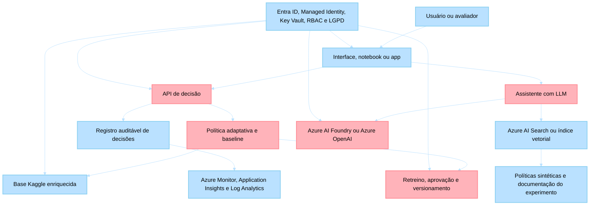

# Datathon 7-MLET — Experimentação Adaptativa em Ofertas Financeiras

> **Fase**: 05 — Deploy Avançado de IA Generativa
> **Turma**: MLET7
> **Formato**: Datathon em grupo
> **Referência da fase**: [Fase 05 — Deploy Avançado de IA Generativa](../../README.md)

## Visão geral

O Datathon 7-MLET propõe um desafio único no domínio financeiro regulado: projetar uma plataforma de experimentação adaptativa para ofertas, mensagens ou próximos passos em canais digitais. Cada grupo deve construir uma solução end-to-end de Machine Learning Engineering e demonstrar como a proposta seria operada com segurança, observabilidade, avaliação e governança.

O objetivo não é reproduzir um sistema bancário real. O objetivo é mostrar maturidade técnica: formular o problema, construir baselines, versionar dados, servir componentes, avaliar qualidade, monitorar risco, documentar limitações e explicar decisões para públicos técnicos e de negócio.

## Experimentação Adaptativa em Ofertas Financeiras

Tema: **experimentação adaptativa em ofertas financeiras**.

### Posicionamento histórico

Esta alternativa estende competências acumuladas nas fases anteriores:

- Fase 01: formulação de problema, EDA, baselines e métricas de negócio.
- Fase 02: pipelines reprodutíveis, versionamento de dados e qualidade de código.
- Fase 03: APIs de decisão, CI/CD, latência e monitoramento operacional.
- Fase 04: fairness, explicabilidade, LGPD, análise causal e governança.
- Fase 05: assistente com LLM para consulta, explicação, avaliação e documentação de experimentos.

### Contexto de negócio

Uma instituição financeira digital precisa decidir, em diferentes canais, qual oferta, mensagem ou próximo passo apresentar para cada cliente elegível. Regras fixas e testes A/B longos podem desperdiçar tráfego, demorar para reagir a mudanças de contexto e dificultar a personalização responsável.

O grupo deve projetar uma plataforma de experimentação adaptativa que aprenda com interações, respeite suitability, mantenha exploração mínima controlada e permita auditoria das decisões. A solução também deve incluir um componente de apoio analítico, como um assistente que resume experimentos, recupera políticas internas sintéticas e explica por que uma decisão foi recomendada.

Um exemplo financeiro ajuda a enxergar a dificuldade do problema: um cliente passa a usar o cartão de crédito em farmácias. Um modelo apressado pode inferir que o cliente está doente; uma leitura contextual mais cuidadosa pode indicar outra hipótese, como o nascimento de um filho e a compra recorrente de itens infantis. O desafio não é adivinhar uma verdade escondida a partir de um único sinal, mas construir um sistema que teste hipóteses, valide contexto e use diferentes fontes de dados para reduzir interpretações frágeis.

Esse é o ponto central de uma abordagem de **multi-armed bandit**: identificar comportamentos distintos, equilibrar exploração e explotação, e aprender com respostas observadas sem congelar a decisão em regras estáticas. No contexto do Datathon, o sistema deve ser capaz de testar variações de oferta, canal, mensagem ou horário e validar se a hipótese de negócio realmente melhora a recompensa esperada. O mesmo raciocínio aparece em banners de websites: nem sempre vale colocar um anúncio no lado direito da página se o usuário ainda está em dúvida, comparando informações ou precisando de um CTA diferente.

### Referências algorítmicas

As soluções devem comparar um baseline simples com pelo menos uma abordagem bandit. Os seguintes algoritmos devem aparecer como referência conceitual ou experimental:

| Algoritmo | Papel no desafio | Evidência esperada |
| --- | --- | --- |
| Thompson Sampling | Exploração bayesiana sob incerteza; útil quando o grupo modela conversão, clique ou recompensa esperada por braço. | Priors ou hipótese de atualização documentados, comparação com baseline e análise de exploração. |
| Nilos-UCB | Referência da família UCB para selecionar ações com base em recompensa esperada e incerteza. | Fórmula, implementação ou adaptação justificada, além de análise do trade-off entre confiança, exploração e conversão. |
| Baseline determinístico | Política simples usada como controle, como regra fixa, melhor braço histórico ou segmentação inicial. | Métrica comparativa clara para mostrar ganho ou limitação da política adaptativa. |

O grupo pode implementar Thompson Sampling, Nilos-UCB, LinUCB ou outra variação contextual, desde que explique a escolha, mostre como o contexto entra na decisão e documente como recompensas atrasadas serão tratadas.

### Valor para o negócio

O valor esperado não está apenas em aumentar clique ou conversão. A entrega deve mostrar como a instituição operaria uma camada de retreino, aprovação estruturada, teste e implementação de novos modelos dentro do mesmo contexto de negócio. A banca deve conseguir enxergar um ciclo de vida organizado para modelos de decisão adaptativa, incluindo versionamento, critérios de promoção, aprovação humana, monitoramento, rollback e governança por diferentes dimensões de negócio.

KPIs sugeridos:

- aumento de recompensa média ou conversão simulada em comparação com uma política baseline;
- redução de regret ou tráfego alocado a alternativas inferiores em simulação offline;
- latência e disponibilidade do serviço de decisão;
- cobertura de auditoria das decisões e equilíbrio de exposição entre segmentos elegíveis.
- tempo para validar uma nova hipótese de oferta, canal ou mensagem;
- percentual de modelos ou políticas com ciclo de aprovação, teste e monitoramento documentado.

### Dataset, enriquecimento sintético e limites de dados

Use a base Kaggle escolhida como referência factual e crie uma camada sintética de experimentação adaptativa sobre ela. Essa camada deve representar impressões, ações disponíveis, contexto, recompensas e eventos atrasados.

Dados permitidos:

- base Kaggle escolhida e documentada;
- interações sintéticas de usuários com ofertas;
- catálogo sintético de produtos ou mensagens;
- features agregadas e não identificáveis de contexto;
- recompensas simuladas, incluindo clique, início de jornada e conversão;
- documentos sintéticos de política comercial e suitability para uso em RAG.

Dados restritos:

- identificadores reais de clientes;
- patrimônio, saldo, renda, idade, gênero, raça ou qualquer dado sensível real;
- regras comerciais privadas, metas internas, listas de leads ou segmentações proprietárias;
- thresholds reais de aprovação, incentivo, remuneração ou campanha.

## Regras de dados e publicação

- Use uma base Kaggle compatível com marketing, ofertas, propensão, campanhas, recomendação ou conversão como base factual do projeto.
- Use dados sintéticos apenas para enriquecer o problema com braços de decisão, recompensas intermediárias, eventos atrasados, políticas comerciais fictícias e golden set.
- Não use dados reais de clientes, estudantes, professores, empresas parceiras ou sistemas internos.
- Não publique segredos, tokens, chaves de API, dumps, traces, logs com dados sensíveis ou modelos binários grandes.
- Não use atributos protegidos para discriminar pessoas ou grupos.
- Documente a base legal, o propósito de uso, a minimização de dados e o ciclo de retenção.
- Mantenha decisões sensíveis com humano no loop. O sistema deve apoiar análise e decisão; não deve executar bloqueios, reportes regulatórios ou recomendações financeiras autônomas sem controle humano.

## Bases Kaggle orientadoras e criação dos datasets

O grupo deve escolher uma base Kaggle adequada ao problema de experimentação adaptativa. A base não precisa ser única para todos os grupos, mas deve ter relação clara com marketing, ofertas, propensão, campanhas, recomendação, conversão ou comportamento de cliente.

Exemplos de bases Kaggle que podem orientar a escolha:

| Base | Link | Como usar no desafio |
| --- | --- | --- |
| Bank Marketing | <https://www.kaggle.com/datasets/henriqueyamahata/bank-marketing> | Campanhas bancárias, propensão de conversão e decisão de oferta. |
| Bank Marketing Data Set | <https://www.kaggle.com/datasets/tunguz/bank-marketing-data-set> | Variação do problema de marketing bancário para comparação ou substituição. |
| Bank Term Deposit Subscription | <https://www.kaggle.com/datasets/dharmik34/bank-term-deposit-subscription> | Assinatura de depósito a prazo como proxy de conversão. |
| Telemarketing JYB Dataset - UCI | <https://www.kaggle.com/datasets/aguado/telemarketing-jyb-dataset> | Campanhas de contato e resposta, útil para comparação de canal ou abordagem. |

Outras bases Kaggle são aceitas se o grupo justificar a aderência ao problema e documentar fonte, versão, licença, colunas, target e limitações. Não use uma base apenas porque ela é fácil de treinar; a escolha precisa sustentar uma pergunta de negócio sobre decisão adaptativa.

Use a base Kaggle escolhida como ponto de partida para:

- construir o baseline preditivo de propensão à conversão;
- derivar contextos de decisão para a política adaptativa;
- simular braços de oferta, mensagens, canais ou horários quando a informação não existir explicitamente no dataset;
- avaliar a política com backtesting offline ou replay simulado;
- documentar limitações, vieses e riscos de generalização.

Tratamento mínimo da base escolhida:

- descarte ou isole colunas que só seriam conhecidas depois da decisão, como `duration` no Bank Marketing;
- registre no README do grupo como a base foi baixada, qual versão foi usada e qual licença se aplica;
- preserve a referência ao Kaggle e à fonte original quando houver;
- não misture o dataset com dados reais externos;
- documente qualquer enriquecimento sintético criado pelo grupo.

### Instruções para criação dos datasets derivados

Cada grupo deve criar uma camada derivada própria, sem alterar a base Kaggle original. Essa camada deve ser versionada e documentada no repositório.

Entregue, no mínimo:

1. `data/kaggle/README.md`: fonte, link, versão, licença, colunas usadas, colunas descartadas e justificativa da escolha.
2. `data/processed/`: base tratada para modelagem, sem colunas de vazamento temporal e com transformações explicadas.
3. `data/synthetic_enrichment/offer_catalog.sample.csv`: catálogo de braços, ofertas, mensagens ou canais simulados.
4. `data/synthetic_enrichment/offer_events.sample.csv`: eventos simulados de impressão, decisão, contexto e braço escolhido.
5. `data/synthetic_enrichment/delayed_rewards.sample.csv`: recompensas simuladas com atraso, como clique, início de jornada e conversão.
6. `data/golden_set/evaluation_cases.jsonl`: pelo menos 20 casos para avaliar decisão, explicação, guardrails e uso do assistente.
7. `reports/data-generation.md`: descrição do processo de criação dos dados derivados, hipóteses, sementes aleatórias, limitações e riscos.

### Escopo técnico

Capacidades obrigatórias:

- baseline simples de decisão para comparação;
- política adaptativa ou contextual, justificada pelo grupo;
- referência explícita a Thompson Sampling e Nilos-UCB na análise algorítmica;
- avaliação offline com a base Kaggle escolhida e enriquecida por eventos sintéticos;
- API, script ou serviço demonstrável para tomada de decisão;
- registro de decisões com contexto, versão de política e justificativa auditável;
- camada de retreino, teste, aprovação estruturada e promoção controlada de novas políticas;
- monitoramento de latência, recompensa, exploração e métricas de fairness;
- assistente ou interface com LLM para explicar experimentos, recuperar políticas sintéticas e apoiar análise humana.

Fora de escopo:

- aconselhamento financeiro individualizado;
- execução real de ofertas financeiras;
- integração com CRM real, app real, corretora real ou dados de produção;
- alteração automática de regras de suitability sem aprovação humana.

## Fluxo de trabalho da aplicação

O diagrama abaixo mostra o fluxo esperado da solução, da base Kaggle escolhida até a apresentação da arquitetura-alvo em Azure. Ele é um mapa de trabalho para orientar a entrega, não uma arquitetura única obrigatória.

```mermaid
%%{init: {'theme':'base', 'themeVariables': {
  'primaryColor':'#FFB3BA',
  'primaryTextColor':'#000',
  'primaryBorderColor':'#FF8B94',
  'lineColor':'#BAE1FF',
  'secondaryColor':'#BAE1FF',
  'tertiaryColor':'#FFFFFF'
}}}%%
flowchart LR
    A[Base Kaggle escolhida] --> B[Pipeline reprodutível]
    B --> C[Enriquecimento sintético]
    C --> D[Baseline e política adaptativa]
    D --> E[Avaliação offline e golden set]
    E --> F[Teste, aprovação e retreino]
    F --> G[API, serviço ou interface demonstrável]
    G --> H[Arquitetura-alvo Azure e plano de deploy]
    H --> I[Governança, observabilidade e segurança]

    classDef primary fill:#FFB3BA,stroke:#FF8B94,stroke-width:2px,color:#000
    classDef secondary fill:#BAE1FF,stroke:#89CFF0,stroke-width:2px,color:#000

    class H,I primary
    class A,B,C,D,E,F,G secondary
```



## Diagrama de componentes Azure

Use este diagrama como referência para explicar o fluxo lógico da aplicação em Azure. O grupo pode substituir serviços dentro das categorias aceitas, desde que mantenha a entrega exclusivamente em Azure e documente os trade-offs.



## Estrutura esperada do repositório

A estrutura abaixo é um contrato mínimo recomendado. O grupo pode reorganizar nomes de pastas, mas deve preservar separação clara entre base Kaggle original, dados processados, enriquecimento sintético, código, avaliação, documentação e arquitetura Azure.

```text
datathon-7mlet-grupo-XX/
├── README.md
├── pyproject.toml
├── .env.example
├── data/
│   ├── kaggle/
│   │   ├── README.md
│   │   └── selected-dataset.csv
│   ├── processed/
│   │   └── modeling_table.parquet
│   ├── synthetic_enrichment/
│   │   ├── offer_events.sample.csv
│   │   ├── offer_catalog.sample.csv
│   │   └── delayed_rewards.sample.csv
│   └── golden_set/
│       └── evaluation_cases.jsonl
├── docs/
│   ├── architecture-azure.md
│   ├── model-card.md
│   ├── system-card.md
│   ├── lgpd-plan.md
│   ├── algorithmic-strategy.md
│   └── demo-day-pitch.md
├── notebooks/
│   └── 01-eda-e-baseline.ipynb
├── src/
│   ├── datathon_offerexp/
│   │   ├── __init__.py
│   │   ├── contracts.py
│   │   ├── policies.py
│   │   ├── evaluation.py
│   │   ├── decision_log.py
│   │   └── app.py
│   └── tests/
│       ├── test_contracts.py
│       ├── test_policies.py
│       └── test_decision_log.py
├── infra/
│   └── azure/
│       ├── architecture.md
│       └── deployment-plan.md
└── reports/
    ├── data-generation.md
    ├── offline-evaluation.md
    ├── fairness-review.md
    ├── retraining-approval-plan.md
    └── observability-plan.md
```

## Exemplos de código didáticos

Os exemplos abaixo ilustram contratos mínimos. Eles não substituem a solução do grupo e não devem ser tratados como implementação final.

### Evento sintético de oferta

```python
from dataclasses import dataclass
from typing import Literal

Arm = Literal["sem_oferta", "educacao_financeira", "simulador_credito"]
Channel = Literal["app", "web", "email"]
Segment = Literal["novo", "recorrente", "reativado"]


@dataclass(frozen=True, slots=True)
class SyntheticOfferEvent:
    event_id: str
    occurred_at: str
    subject_key: str
    channel: Channel
    segment: Segment
    available_arms: tuple[Arm, ...]
    context: dict[str, str | float | bool]
    chosen_arm: Arm | None = None
    reward: float | None = None
```

### Seleção mínima de braço

```python
import random
from collections.abc import Mapping
from typing import Literal

PolicyMode = Literal["baseline", "adaptive"]


def select_arm(
    event: SyntheticOfferEvent,
    estimated_scores: Mapping[Arm, float],
    *,
    mode: PolicyMode,
    explore_rate: float = 0.05,
    rng: random.Random | None = None,
) -> Arm:
    if not event.available_arms:
        raise ValueError("Evento sem alternativas elegiveis.")

    rng = rng or random.Random()

    if mode == "baseline":
        return event.available_arms[0]

    if rng.random() < explore_rate:
        return rng.choice(event.available_arms)

    return max(event.available_arms, key=lambda arm: estimated_scores.get(arm, 0.0))
```

### Registro auditável de decisão

```python
from dataclasses import asdict, dataclass
from datetime import datetime, timezone


@dataclass(frozen=True, slots=True)
class DecisionLog:
    decision_id: str
    event_id: str
    policy_version: str
    selected_arm: Arm
    mode: PolicyMode
    exploration: bool
    reason_codes: tuple[str, ...]
    created_at: str


def decision_log_to_record(log: DecisionLog) -> dict[str, object]:
    return asdict(log)


log = DecisionLog(
    decision_id="dec_sintetica_001",
    event_id="evt_sintetico_001",
    policy_version="policy-demo-v0",
    selected_arm="educacao_financeira",
    mode="adaptive",
    exploration=False,
    reason_codes=("elegivel", "maior_score_sintetico"),
    created_at=datetime.now(timezone.utc).isoformat(),
)
```

### Entregáveis esperados

- Definição formal de braços, contexto, recompensa e horizonte temporal.
- Simulação ou backtesting comparando política baseline e política adaptativa.
- Tratamento explícito de cold-start e recompensas atrasadas.
- Logs explicáveis de decisão.
- Análise de fairness de exposição entre segmentos sintéticos elegíveis.
- System Card com riscos de manipulação, reward hacking, viés e uso indevido.

### Guardrails de publicação

- Não publique uma arquitetura como única resposta esperada.
- Não transforme o assistente em recomendador financeiro autônomo.
- Não use dados reais nem simule que a solução está pronta para produção regulada.
- Não otimize apenas clique se isso conflitar com suitability, privacidade ou experiência do cliente.

## Objetivo final: uma plataforma que aprende de forma automática

O alvo do Datathon não é apresentar um relatório com a melhor variante escolhida pela equipe. O alvo é entregar **uma plataforma que aprende de forma automática**, que ajusta a política de decisão à medida que os eventos chegam e as recompensas se confirmam.

A diferença é estrutural:

- Em um **teste A/B convencional**, o sistema apenas executa duas variantes em paralelo. Quem decide qual variante vence é um **Cientista de Dados**, ao final do experimento, olhando intervalos de confiança em uma planilha ou notebook. A decisão é humana, lenta e tomada uma vez só.
- Em **Multi-Armed Bandits**, é o **próprio sistema** que identifica, decisão a decisão, qual a melhor ação a executar com maior retorno potencial. A política se atualiza a cada recompensa observada, equilibrando exploração de braços incertos e explotação dos braços que já demonstraram desempenho. Não há um momento único de decisão humana: há um ciclo contínuo de aprendizado.

A banca avalia se a entrega do grupo se comporta como plataforma, e não como experimento pontual. Para isso observa:

- Se o **serviço entrega decisões automáticas** a partir do contexto recebido, sem revisão manual a cada chamada.
- Se há **registro de recompensas e atualização da política**, mesmo que em ambiente offline ou simulado.
- Se o **ciclo de retreino, teste, aprovação estruturada e promoção** está descrito e demonstrado, com critérios objetivos para colocar uma nova política em produção.
- Se a **arquitetura-alvo Azure** sustenta esse ciclo continuamente, com componentes para ingestão, decisão, registro, avaliação e governança.
- Se o **golden set, os guardrails e o monitoramento** são usados para barrar políticas que aprenderam atalhos errados ou exploraram caminhos indesejados.

O Demo Day premia grupos que mostram um sistema que aprende sozinho qual é a melhor decisão a tomar, com humanos no papel de **revisores e responsáveis pela governança** — e não no papel de juízes de cada experimento.

## Proveniência e revisão

| Campo | Valor |
| --- | --- |
| Família de artefato | Datathon business-case packaging |
| Fonte | Intake local de casos financeiros para Datathon, sanitizado para publicação pública |
| Data de captura | Maio/2026 |
| Base de publicação | Material didático sintético e public-safe para MLET7 |
| Status de sanitização | Removidos detalhes privados, arquiteturas prescritivas, thresholds operacionais e atalhos de avaliação |
| Destino canônico | `fase-05-deploy-avancado-de-ia-generativa/datathon/7mlet/` |
| Revisão | Coordenação MLET |
| Data de revisão | 2026-05-22 |
| Restrições residuais | Usar somente como enquadramento de problema; não tratar como solução oficial ou especificação de produção |

## Entregáveis obrigatórios

Os entregáveis abaixo são organizados em nove etapas acumulativas (0–8). Cada etapa traz um objetivo, uma lista detalhada de artefatos técnicos exigidos e o critério de evidência de aceite que a banca usa para considerar a etapa cumprida. Uma etapa posterior não compensa uma etapa anterior ausente: um grupo com modelo sofisticado, mas sem dataset rastreável, avaliação reproduzível ou aprovação de ciclo de vida, é penalizado na validação técnica. A ausência de um subitem dentro de uma etapa não é compensada pela presença dos demais.

1. **Etapa 0 — Organização do projeto.**
   - *Objetivo:* preparar um repositório público reutilizável por outra pessoa sem contexto oral do grupo.
   - URL pública do repositório com nome no padrão `datathon-7mlet-grupo-XX`.
   - `README.md` com visão do problema, escopo, escolhas de design, instruções de execução local, mapa de pastas, lista de comandos e limitações.
   - `pyproject.toml` declarando dependências, versão de Python, ponto de entrada e ferramentas de desenvolvimento.
   - `.env.example` listando variáveis de ambiente necessárias, sem valores reais.
   - Licença, `.gitignore` adequado e ausência de segredos, dados sensíveis ou modelos binários grandes versionados.
   - Histórico de commits que mostre evolução do trabalho, não apenas um commit final.
   - *Evidência de aceite:* uma pessoa externa consegue instalar dependências, entender o fluxo e executar pelo menos um comando de validação sem precisar de explicação oral do grupo.

2. **Etapa 1 — Base Kaggle e EDA.**
   - *Objetivo:* transformar uma base Kaggle compatível em fonte confiável para experimentação.
   - `data/kaggle/README.md` com link da base escolhida, versão usada, fonte, licença, limitações e instruções de download.
   - Dicionário de dados, notebook de EDA e relatório de qualidade.
   - Camada de dados em código que carrega a base, registra fonte/versão/licença e gera os datasets derivados documentados.
   - Decisão documentada sobre colunas que geram vazamento temporal ou pós-contato, com justificativa de descarte ou tratamento.
   - *Evidência de aceite:* a banca consegue rastrear a origem do dataset, entender as variáveis usadas e verificar que não houve vazamento de informação pós-contato no modelo de decisão.

3. **Etapa 2 — Enriquecimento sintético.**
   - *Objetivo:* criar a camada de experimentação adaptativa sobre o dataset escolhido.
   - Catálogo sintético de braços/ofertas separado fisicamente do dataset Kaggle original.
   - Eventos de impressão, contexto de decisão e recompensas intermediárias com sementes aleatórias controladas.
   - Modelagem de delayed rewards e do horizonte temporal documentada.
   - Schema dos arquivos sintéticos e o processo de geração descritos no repositório.
   - *Evidência de aceite:* os arquivos sintéticos têm schema documentado e explicam como braços, contexto, recompensa e horizonte temporal foram definidos, separados da base Kaggle original.

4. **Etapa 3 — Baseline e estratégia algorítmica.**
   - *Objetivo:* comparar política simples com abordagem multi-armed bandit.
   - Pelo menos um baseline determinístico implementado.
   - Implementação ou simulação de Thompson Sampling.
   - Referência experimental ou justificativa explícita de Nilos-UCB na análise algorítmica.
   - Métricas de recompensa, regret, exploração e conversão simulada calculadas e reportadas.
   - Tratamento de cold-start e de recompensas atrasadas descrito.
   - *Evidência de aceite:* o grupo apresenta comparação quantitativa entre baseline e política adaptativa, com justificativa do algoritmo escolhido e do tratamento de cold-start e delayed rewards.

5. **Etapa 4 — Avaliação offline e golden set.**
   - *Objetivo:* medir qualidade técnica e risco antes de servir a decisão.
   - Script ou notebook de avaliação offline reproduzível por linha de comando ou notebook, com métricas justificadas.
   - Golden set com no mínimo 20 exemplos versionados em `data/golden_set/evaluation_cases.jsonl` ou formato equivalente.
   - Cobertura do golden set sobre casos típicos, casos de borda, segmentos sintéticos elegíveis e cenários adversariais.
   - Cada caso traz contexto, ação esperada, recompensa esperada, justificativa e critério explícito de pass/fail.
   - Matriz de métricas, análise de sensibilidade e análise de fairness de exposição entre segmentos sintéticos.
   - *Evidência de aceite:* as métricas são reproduzíveis, o golden set está versionado, e a análise explica limitações, vieses e condições em que a política não deve ser usada.

6. **Etapa 5 — Serviço ou interface demonstrável.**
   - *Objetivo:* expor a decisão de forma controlada e auditável.
   - API, CLI, notebook executável ou app demonstrável que recebe um contexto e devolve uma decisão.
   - Contrato de entrada e saída documentado, com exemplo de chamada e tratamento de erro.
   - Log auditável de decisão com reason codes, braço selecionado e versão da política aplicada.
   - Comando único ou script que permita reproduzir o pipeline ponta a ponta em ambiente local.
   - Suíte mínima de testes automatizados cobrindo contratos de dados, política e registro de decisão.
   - *Evidência de aceite:* a banca consegue executar uma decisão de exemplo, ver o braço selecionado, a justificativa, a versão da política e o registro auditável gerado.

7. **Etapa 6 — Arquitetura-alvo Azure.**
   - *Objetivo:* demonstrar como a solução seria operada em Azure.
   - `docs/architecture-azure.md` com diagrama Mermaid e mapeamento de serviços Azure.
   - Plano de deploy e estimativa qualitativa de custo.
   - Cobertura das camadas de compute, API, dados, IA/RAG, observabilidade, segurança, identidade e governança.
   - Plano de gestão de segredos e credenciais usando Azure Key Vault e Managed Identity.
   - *Evidência de aceite:* a arquitetura usa exclusivamente Azure, cobre as camadas acima e justifica trade-offs sem depender de outro provedor de nuvem.

8. **Etapa 7 — Ciclo de vida MLOps.**
   - *Objetivo:* mostrar como novas políticas seriam testadas, aprovadas e promovidas.
   - Plano de retreino com critérios de promoção, approval gate, rollback e versionamento de política.
   - Monitoramento de drift e de recompensa documentado.
   - Rastreio de experimentos em MLflow ou ferramenta equivalente.
   - Procedimento de teste, aprovação humana estruturada e promoção de novas políticas para produção controlada.
   - *Evidência de aceite:* o grupo demonstra como uma nova hipótese de oferta/canal/mensagem sairia de experimento para produção controlada, com aprovação humana e rollback documentado.

9. **Etapa 8 — Governança, Demo Day e relatórios.**
   - *Objetivo:* fechar a entrega com responsabilidade operacional e narrativa coerente.
   - `docs/model-card.md` com nome do modelo, versão, dados de treino e avaliação, métricas, intended use, out-of-scope use, análise de fairness, vieses conhecidos e limitações técnicas.
   - `docs/system-card.md` com escopo do sistema, fluxo de decisão, dependências, guardrails, cenários de risco (reward hacking, manipulação do contexto, abuso do assistente, violação de suitability) e plano de monitoramento.
   - `docs/lgpd-plan.md` com base legal, finalidade, minimização, ciclo de retenção, mapeamento de identificadores e atributos protegidos, política de logs e telemetria e plano de resposta a incidentes.
   - Relatório técnico de até 10 páginas cobrindo problema, base escolhida, enriquecimento sintético, modelagem como multi-armed bandit, comparação quantitativa, arquitetura-alvo Azure, ciclo MLOps, limitações, riscos, hipóteses, trabalhos futuros e referências bibliográficas.
   - Pitch de até 10 minutos seguido por 5 minutos de perguntas, com slides versionados no repositório em PDF ou formato aberto, roteiro cobrindo problema/abordagem/demonstração/evidências/riscos/governança/impacto, demonstração ao vivo ou gravada com cenário de exemplo e cenário adversarial, e distribuição clara de papéis entre integrantes.
   - Demonstração da plataforma em operação durante o pitch é desejável e soma pontos extras na avaliação; o grupo deve indicar o cenário escolhido, registrar o plano de contingência caso a execução ao vivo falhe e versionar a gravação ou dataset de demonstração no repositório.
   - Cobertura no pitch dos critérios de apresentação: FinOps com ROI, custo por serviço Azure e Total Cost of Ownership; justificativa de arquitetura técnica com diagrama, fronteiras de componentes e alternativas descartadas; cenários de escala e redução explicando maleabilidade arquitetônica sob diferentes volumes de requisições.
   - Plano de revisão periódica do model card e do system card com responsáveis e cadência definidos.
   - *Evidência de aceite:* a banca encontra narrativa coerente de problema, solução, evidências, riscos, governança e valor de negócio, sem alegar prontidão para produção real regulada.

## Critérios de avaliação

A avaliação segue o contrato da Fase 05:

| Dimensão | Peso | O que a banca procura |
| --- | ---: | --- |
| Critérios de negócio | 30% | aderência ao problema escolhido, clareza de impacto, viabilidade, comunicação executiva |
| Validação técnica global | 70% | pipeline, MLOps, avaliação, observabilidade, segurança, governança, documentação e uso de PyTorch/MLflow quando aplicável |

Os grupos devem definir métricas específicas para o desafio. Essas métricas precisam ser justificadas no relatório técnico e conectadas ao impacto de negócio, mas não substituem os critérios oficiais da fase.

### Critério obrigatório — Arquitetura-alvo em Azure

A entrega arquitetural do Datathon deve ser planejada exclusivamente para Microsoft Azure. O grupo não precisa publicar recursos pagos nem manter uma implantação ativa em nuvem, mas deve apresentar uma arquitetura-alvo Azure, um plano de implantação e a justificativa dos serviços escolhidos. Arquiteturas baseadas em AWS, Google Cloud, provedores locais ou soluções genéricas multi-cloud ficam fora do escopo da avaliação, exceto quando usadas apenas como comparação breve de trade-offs.

A banca não espera uma arquitetura única. O grupo pode escolher diferentes combinações de serviços Azure, desde que a proposta cubra computação, exposição de API ou interface, persistência de dados, observabilidade, segurança/governança e o componente de IA/RAG quando aplicável.

| Categoria | Exemplos de serviços Azure aceitáveis |
| --- | --- |
| Computação e execução | Azure Container Apps, Azure App Service, Azure Functions, AKS, Azure Machine Learning endpoints, Azure Databricks Jobs |
| API, interface e integração | Azure API Management, endpoints em App Service/Container Apps, Azure Functions HTTP, Azure Static Web Apps, Azure Front Door quando fizer sentido |
| Dados e eventos | Azure Blob Storage ou Data Lake Storage Gen2, Azure SQL, Azure Database for PostgreSQL, Azure Cosmos DB, Azure Service Bus, Azure Event Hubs |
| IA, agentes e RAG | Azure AI Foundry, Azure OpenAI/Foundry Models, Azure AI Search, Azure Machine Learning, embeddings, busca vetorial, busca híbrida ou semântica |
| Observabilidade | Azure Monitor, Application Insights, Log Analytics, dashboards, alertas e rastreamento de métricas técnicas e de negócio |
| Segurança e governança | Microsoft Entra ID, Managed Identity, Azure Key Vault, RBAC, Azure Policy, private endpoints/VNet quando justificado, plano LGPD e revisão humana |

A arquitetura deve explicar como decisões, experimentos, políticas, modelos, prompts e versões seriam rastreados. Também deve indicar quais métricas seriam monitoradas em produção, incluindo latência, disponibilidade, custo estimado, qualidade da recomendação, exploração, fairness, segurança e uso do assistente com LLM.

### Critérios de apresentação

Além do conteúdo técnico, a banca avalia trê dimensões específicas durante o pitch do Demo Day. Os grupos devem reservar tempo no roteiro para tratar cada uma delas com evidência (números, faixas, diagramas, premissas), não apenas com afirmação.

| Dimensão | O que a banca procura |
| --- | --- |
| FinOps (ROI, custo e TCO) | Estimativa qualitativa de custo de execução por serviço Azure escolhido, projeção de Retorno sobre Investimento (ROI) considerando o ganho de negócio esperado da política adaptativa em relação a uma campanha estática, e Total Cost of Ownership (TCO) cobrindo desenvolvimento, operação, observabilidade, retreino, governança e suporte. O grupo deve discutir trade-offs entre alternativas mais baratas e mais caras, identificar o ponto de equilíbrio em que a plataforma adaptativa compensa o custo adicional e indicar quais componentes geram custo mesmo ociosos. |
| Arquitetura técnica | Justificativa explícita de cada serviço Azure escolhido, mapeamento dos limites entre componentes, fluxos de dados e de decisão, pontos de falha, fronteiras de segurança e identidade, e como o ciclo de vida de modelos e políticas é controlado. A banca espera coerência entre o diagrama de componentes, o código do repositório e o plano de operação, sem zonas cinzentas entre camadas, e racional sobre alternativas descartadas. |
| Cenários de escala e redução | Maleabilidade arquitetônica em função do volume de requisições: como a arquitetura cresce de um cenário de baixa carga (poucas decisões por hora, experimentação isolada) para alta carga (picos sazonais, campanhas simultâneas, múltiplos canais), e como a redução é tratada quando o uso cai. O grupo deve indicar quais serviços escalam automaticamente, quais exigem ajuste manual, quais geram custo mesmo ociosos, e como o sistema preserva latência aceitável, qualidade da exploração e garantias de segurança sob pressão. |

A análise não exige números reais de produção, mas exige racional consistente. Estimativas qualitativas, comparações relativas, faixas de magnitude e cenários hipotéticos com premissas claras são aceitos, desde que apresentados com transparência sobre as suposições e referência ao diagrama de arquitetura Azure do repositório.

Demonstrações ao vivo ou gravadas durante a apresentação são desejáveis e somam pontos extras na avaliação. Um pitch que mostra a plataforma decidindo — selecionando um braço, registrando a recompensa, evoluindo a política e reagindo a um cenário adversarial — tem peso narrativo maior do que um pitch que apenas descreve o que o sistema faria, mesmo quando o cenário é sintético ou executado em ambiente local. Os grupos devem reservar tempo de pitch para a demonstração e prever um plano de contingência caso ela falhe ao vivo (por exemplo, gravação alternativa, dataset de demonstração reduzido, cenário pré-renderizado).

## Checklist antes do Demo Day

- [ ] O README do repositório do grupo explica o desafio, a execução local e as limitações.
- [ ] O pipeline usa uma base Kaggle compatível e documenta download, versão, fonte, licença e limitações.
- [ ] A base processada e o enriquecimento sintético estão documentados e separados da base Kaggle original.
- [ ] Os experimentos estão rastreados em MLflow ou ferramenta equivalente.
- [ ] Há pelo menos um baseline e uma abordagem principal comparados com métricas justificadas.
- [ ] A análise algorítmica referencia Thompson Sampling e Nilos-UCB, com justificativa de escolha ou descarte.
- [ ] A avaliação inclui um golden set com pelo menos 20 exemplos.
- [ ] A camada de retreino, teste, aprovação estruturada e promoção de novas políticas está documentada.
- [ ] O serviço, API, notebook executável ou interface demonstrável funciona com instruções claras.
- [ ] A arquitetura-alvo e o plano de deploy usam exclusivamente serviços Azure.
- [ ] O fluxo de trabalho da aplicação está documentado com diagrama Mermaid e explicação dos componentes.
- [ ] Os guardrails foram testados com cenários adversariais.
- [ ] Model Card, System Card e plano LGPD estão completos.
- [ ] O pitch separa problema, abordagem, demonstração, evidências, riscos e impacto.
- [ ] O pitch cobre FinOps com ROI, custo qualitativo por serviço Azure e Total Cost of Ownership.
- [ ] O pitch justifica a arquitetura técnica com diagrama, fronteiras de componentes e alternativas descartadas.
- [ ] O pitch apresenta cenários de escala e redução por volume de requisições, indicando comportamento de cada serviço sob baixa e alta carga.
- [ ] O pitch inclui demonstração ao vivo ou gravada da plataforma em operação, com plano de contingência caso a execução ao vivo falhe (desejável, soma pontos extras na avaliação).
